# Shepherd Model Gateway (SMG)

High-performance model-routing gateway for large-scale LLM deployments. Centralizes worker lifecycle management, balances traffic across HTTP/gRPC/OpenAI-compatible backends, and provides enterprise-ready control over history storage, MCP tooling, and privacy-sensitive workflows.

<p align="center">
  
</p>

## Why SMG?

| | |
|:--|:--|
| **🚀 Maximize GPU Utilization** | Cache-aware routing understands your inference engine's KV cache state—whether vLLM, SGLang, or TensorRT-LLM—to reuse prefixes and reduce redundant computation. |
| **🔌 One API, Any Backend** | Route to self-hosted models (vLLM, SGLang, TensorRT-LLM) or cloud providers (OpenAI, Anthropic, Gemini, Bedrock, and more) through a single unified endpoint. |
| **⚡ Built for Speed** | Native Rust with gRPC pipelines, sub-millisecond routing decisions, and zero-copy tokenization. Circuit breakers and automatic failover keep things running. |
| **🔒 Enterprise Control** | Multi-tenant rate limiting with OIDC, WebAssembly plugins for custom logic, and a privacy boundary that keeps conversation history within your infrastructure. |
| **📊 Full Observability** | 40+ Prometheus metrics, OpenTelemetry tracing, and structured JSON logs with request correlation—know exactly what's happening at every layer. |

**API Coverage:** OpenAI Chat/Completions/Embeddings, Responses API for agents, Anthropic Messages, and MCP tool execution.

## Quick Start

**Install** — pick your preferred method:

```bash
# Docker
docker pull lightseekorg/smg:latest

# Python
pip install smg

# Rust
cargo install smg
```

**Run** — point SMG at your inference workers:

```bash
smg --worker-urls http://localhost:8000 --policy cache_aware
```

**Use** — send requests to the gateway:

```bash
curl http://localhost:30000/v1/chat/completions \
  -H "Content-Type: application/json" \
  -d '{"model": "llama3", "messages": [{"role": "user", "content": "Hello!"}]}'
```

That's it. SMG is now load-balancing requests across your workers with cache-aware routing.

## Documentation

- [Installation](docs/getting-started/installation.md) — all installation options and requirements
- [Architecture](docs/concepts/architecture/overview.md) — how SMG routes and balances requests
- [Configuration](docs/reference/configuration.md) — full reference for all options
- [API Reference](docs/reference/api/openai.md) — endpoint specs and examples
- [Deployment Guide](docs/tasks/deployment/kubernetes.md) — production deployment on Kubernetes

## License

Apache 2.0
