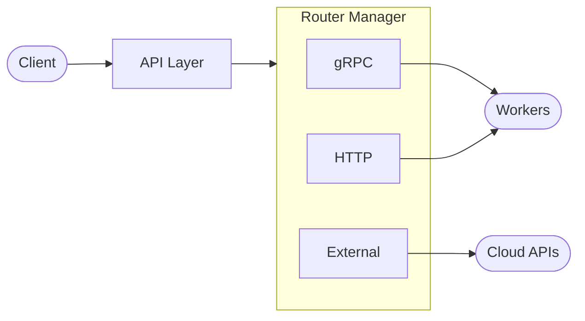

# Concepts

This section explains the core concepts behind Shepherd Model Gateway. Understanding these concepts helps you design, deploy, and operate SMG effectively.

## What is SMG?

Shepherd Model Gateway is an **inference gateway** that adapts to your deployment:

| With gRPC Workers | With HTTP Workers | With External APIs |
|-------------------|-------------------|-------------------|
| Full OpenAI server | Intelligent proxy | Unified routing |
| Tokenization + caching | Load balancing | Model discovery |
| Tool parsing + MCP | PD disaggregation | Provider abstraction |
| Reasoning loops | Health-aware failover | API translation |

Unlike generic load balancers, SMG understands LLM patterns: prefix caching, token streaming, and KV cache affinity.

---

## Core Components

| Layer | Purpose |
|-------|---------|
| [API Layer](architecture/overview.md) | Inference, utility, and admin endpoints |
| [Router Manager](architecture/data-plane.md) | Selects path based on worker type |
| [Control Plane](architecture/control-plane.md) | Health monitoring, service discovery |

---

## Key Concepts

### :material-sitemap: Architecture

How SMG's control plane and data plane work together.

[Learn about Architecture →](architecture/overview.md)

### :material-scale-balance: Load Balancing

Routing strategies from simple random selection to cache-aware algorithms.

[Learn about Routing →](routing/load-balancing.md)

### :material-lightning-bolt: Performance

Tokenizer caching and optimization strategies for high-throughput deployments.

[Learn about Performance →](performance/tokenizer-caching.md)

### :material-puzzle: Extensibility

WASM plugins and MCP integration for custom middleware and external tools.

[Learn about Extensibility →](extensibility/wasm-plugins.md)

### :material-shield: Reliability

Circuit breakers, retries, and rate limiting for resilient deployments.

[Learn about Reliability →](reliability/circuit-breakers.md)

---

## Concept Categories

### Architecture

Understand how SMG is structured internally:

- [Architecture Overview](architecture/overview.md) — High-level system design
- [Control Plane](architecture/control-plane.md) — Worker management and health checking
- [Data Plane](architecture/data-plane.md) — Request routing and response streaming

### Routing

Learn how SMG selects workers for requests:

- [Load Balancing](routing/load-balancing.md) — Available routing policies
- [Cache-Aware Routing](routing/cache-aware.md) — Prefix-based worker affinity

### Performance

Optimize SMG for high-throughput deployments:

- [Tokenizer Caching](performance/tokenizer-caching.md) — Two-level cache for tokenization

### Extensibility

Extend SMG with custom logic and external tools:

- [WASM Plugins](extensibility/wasm-plugins.md) — Dynamic middleware with WebAssembly
- [Model Context Protocol](extensibility/mcp.md) — External tool integration via MCP

### Reliability

Understand how SMG handles failures:

- [Circuit Breakers](reliability/circuit-breakers.md) — Preventing cascade failures
- [Rate Limiting](reliability/rate-limiting.md) — Protecting workers from overload

---

## Design Principles

SMG is built on several core principles:

1. **Transparency**: SMG should be invisible to well-behaved applications. The same requests that work against a single worker should work through SMG.

2. **Performance**: Routing decisions happen in microseconds. SMG never becomes the bottleneck.

3. **Reliability**: Individual worker failures don't cause application failures. SMG routes around problems automatically.

4. **Observability**: You can always understand what SMG is doing through metrics, traces, and logs.

5. **Simplicity**: Common cases are simple. Advanced features are available but not required.
