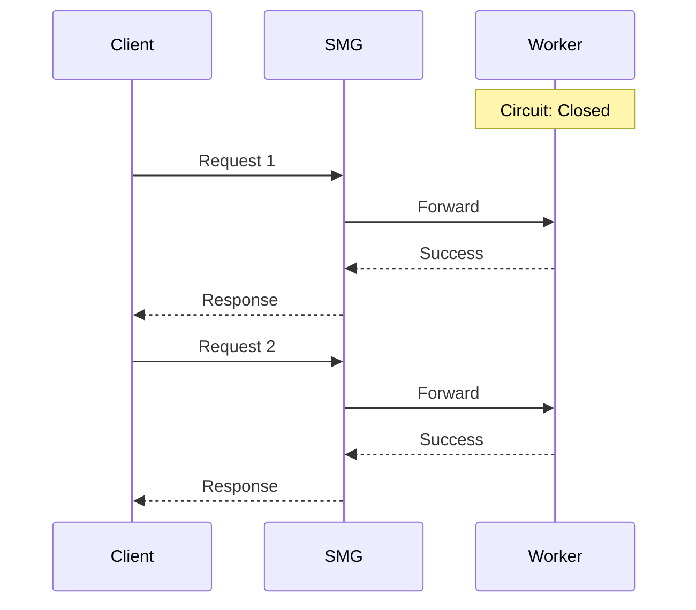
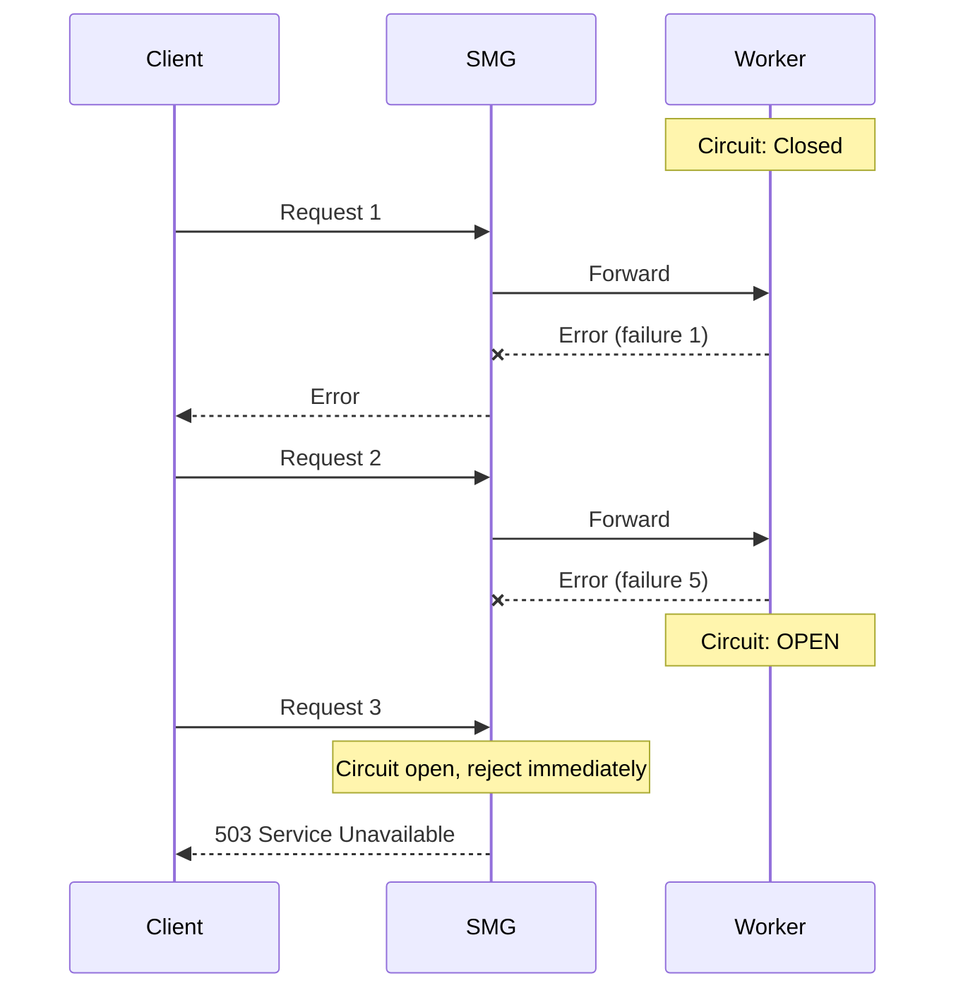
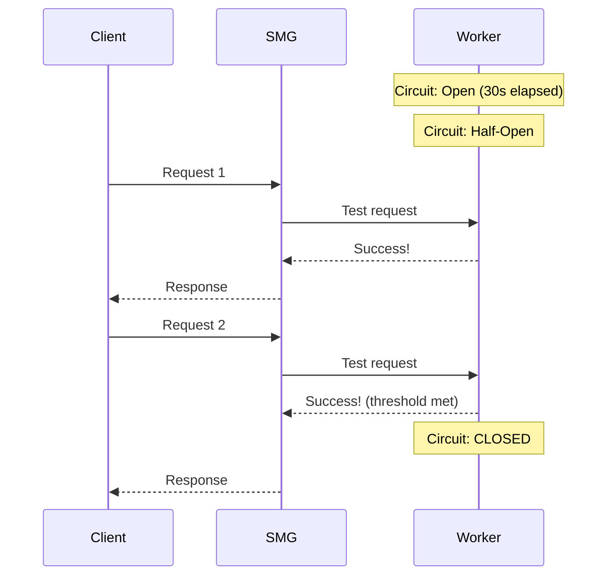

# Circuit Breakers

Circuit breakers prevent cascade failures by stopping traffic to unhealthy workers. They're essential for maintaining system stability when workers fail.

---

## Overview

<div class="grid" markdown>

<div class="card" markdown>

### :material-electric-switch: Automatic Isolation

Automatically isolate unhealthy workers to prevent cascade failures across your inference fleet.

</div>

<div class="card" markdown>

### :material-lightning-bolt: Fail Fast

Detect failing workers and stop sending traffic immediately—no wasted requests or timeout waits.

</div>

<div class="card" markdown>

### :material-refresh: Self-Healing

Automatically test recovery and restore traffic when workers become healthy again.

</div>

<div class="card" markdown>

### :material-chart-line: Observable

Full Prometheus metrics for state transitions, failure counts, and recovery timing.

</div>

</div>

---

## Why Circuit Breakers?

Without circuit breakers, a failing worker can cause:

1. **Wasted requests**: Requests sent to failing workers timeout
2. **Increased latency**: Clients wait for timeouts before retry
3. **Resource exhaustion**: Connections pile up to dead workers
4. **Cascade failures**: Retry storms overwhelm remaining workers

Circuit breakers **fail fast**—they detect failing workers and stop sending traffic immediately.

---

## How It Works

<div class="architecture-diagram">
  
</div>

Each worker has its own circuit breaker with three states:

<div class="grid" markdown>

<div class="card" markdown>

### :material-check-circle: Closed State

**Normal operation** - requests flow through.

- Failures increment counter
- Success resets counter to zero
- Opens when failures ≥ threshold

</div>

<div class="card" markdown>

### :material-close-circle: Open State

**Circuit tripped** - requests rejected immediately.

- Worker isolated from pool
- No traffic sent to worker
- Transitions to half-open after timeout

</div>

<div class="card" markdown>

### :material-help-circle: Half-Open State

**Testing recovery** - limited probe requests allowed.

- Success → close circuit
- Any failure → reopen circuit
- Gradual traffic restoration

</div>

</div>

---

## State Transitions

### Closed → Open

The circuit **opens** when:

```
consecutive_failures >= failure_threshold
```

Within the sliding window (`--cb-window-duration-secs`).

### Open → Half-Open

After the circuit has been open for `--cb-timeout-duration-secs`, it transitions to half-open to test if the worker has recovered.

### Half-Open → Closed

If `--cb-success-threshold` consecutive requests succeed, the circuit closes and normal operation resumes.

### Half-Open → Open

If any request fails during half-open, the circuit immediately reopens.

---

## Configuration

```bash
smg \
  --worker-urls http://w1:8000 http://w2:8000 \
  --cb-failure-threshold 5 \
  --cb-success-threshold 2 \
  --cb-timeout-duration-secs 30 \
  --cb-window-duration-secs 60
```

### Parameters

| Parameter | Default | Description |
|-----------|---------|-------------|
| `--cb-failure-threshold` | `10` | Consecutive failures before circuit opens |
| `--cb-success-threshold` | `3` | Successes in half-open state to close circuit |
| `--cb-timeout-duration-secs` | `60` | Seconds before open circuit transitions to half-open |
| `--cb-window-duration-secs` | `120` | Sliding window for counting failures |
| `--disable-circuit-breaker` | `false` | Disable circuit breakers entirely |

### Configuration Examples

<div class="grid" markdown>

<div class="card" markdown>

#### :material-lightning-bolt: Fast Circuit Opening

Sensitive to failures—isolate workers quickly.

```bash
smg \
  --cb-failure-threshold 3 \
  --cb-timeout-duration-secs 30
```

**Use when**: Critical availability, latency-sensitive applications

</div>

<div class="card" markdown>

#### :material-shield: Tolerant Configuration

Allow occasional failures before tripping.

```bash
smg \
  --cb-failure-threshold 20 \
  --cb-success-threshold 5 \
  --cb-timeout-duration-secs 120
```

**Use when**: Flaky workers, network instability, batch processing

</div>

</div>

### Tuning Guidelines

| Scenario | Recommendation |
|----------|---------------|
| **Flaky workers** | Higher `failure_threshold`, shorter `timeout` |
| **Critical availability** | Lower `failure_threshold`, longer `timeout` |
| **Fast recovery workers** | Lower `timeout`, lower `success_threshold` |
| **Slow recovery workers** | Higher `timeout`, higher `success_threshold` |

---

## Example Scenarios

### Normal Operation



### Worker Fails



### Recovery



---

## Monitoring

### Metrics

| Metric | Description |
|--------|-------------|
| `smg_circuit_breaker_state` | Current state per worker (0=closed, 1=open, 2=half-open) |
| `smg_circuit_breaker_transitions_total` | State transitions by worker and direction |
| `smg_circuit_breaker_consecutive_failures` | Current failure count per worker |
| `smg_circuit_breaker_consecutive_successes` | Current success count per worker |

### Useful PromQL Queries

<div class="grid" markdown>

<div class="card" markdown>

#### Current States

```promql
# Current circuit breaker states
smg_circuit_breaker_state

# Workers with open circuits
count(smg_circuit_breaker_state == 1)
```

</div>

<div class="card" markdown>

#### Transitions

```promql
# State transitions rate
rate(smg_circuit_breaker_transitions_total[5m])

# Consecutive failures per worker
smg_circuit_breaker_consecutive_failures
```

</div>

</div>

### Alert Thresholds

| Metric | Warning | Critical | Action |
|--------|---------|----------|--------|
| Open circuits | 1 worker | All workers | Investigate worker health |
| Transition rate | >10/min | >50/min | Check for flapping |
| Consecutive failures | >5 | >threshold | Worker likely failing |

### Alerting Example

```yaml
groups:
  - name: smg-circuit-breakers
    rules:
      - alert: CircuitBreakerOpen
        expr: smg_circuit_breaker_state == 1
        for: 1m
        labels:
          severity: warning
        annotations:
          summary: "Circuit breaker open for {{ $labels.worker_id }}"

      - alert: AllCircuitsOpen
        expr: count(smg_circuit_breaker_state == 1) == count(smg_circuit_breaker_state)
        for: 30s
        labels:
          severity: critical
        annotations:
          summary: "All worker circuit breakers are open"
```

---

## Interaction with Other Features

### Retries

When a circuit is **open**:

- Requests are rejected **immediately** (no retry to that worker)
- Other workers may be tried if available

When a circuit is **half-open**:

- Only a limited number of test requests are sent
- Failures don't count against retry budget

### Health Checks

Circuit breakers and health checks work together:

| Health Check | Circuit Breaker | Worker State |
|--------------|-----------------|--------------|
| Passing | Closed | Healthy, receiving traffic |
| Failing | Open | Unhealthy, no traffic |
| Passing | Open | Recovering, limited traffic |

---

## Disabling Circuit Breakers

In some cases, you may want to disable circuit breakers:

```bash
smg --worker-urls http://w1:8000 --disable-circuit-breaker
```

!!! warning "Not Recommended"
    Disabling circuit breakers removes an important safety mechanism. Only do this if you have another layer providing similar protection.

---

## What's Next?

<div class="grid" markdown>

<div class="card" markdown>

### :material-refresh: Retries

Automatic retry with exponential backoff for transient failures.

[Retries →](retries.md)

</div>

<div class="card" markdown>

### :material-heart-pulse: Health Checks

Proactive worker monitoring and failure detection.

[Health Checks →](health-checks.md)

</div>

<div class="card" markdown>

### :material-traffic-light: Rate Limiting

Protect workers from overload with token bucket rate limiting.

[Rate Limiting →](rate-limiting.md)

</div>

<div class="card" markdown>

### :material-chart-box: Metrics Reference

Complete list of circuit breaker metrics.

[Metrics Reference →](../../reference/metrics.md)

</div>

</div>
