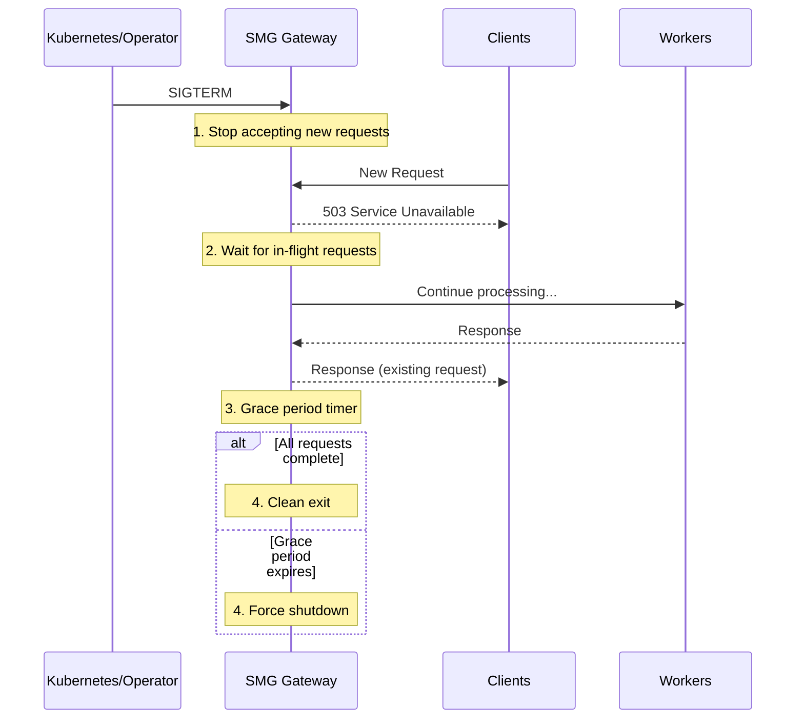

# Graceful Shutdown

Graceful shutdown allows in-flight requests to complete before the gateway terminates, preventing request failures during deployments and restarts.

---

## Overview

<div class="grid" markdown>

<div class="card" markdown>

### :material-power: Clean Termination

Allow existing requests to finish rather than abruptly closing connections.

</div>

<div class="card" markdown>

### :material-rocket-launch: Zero-Downtime Deployments

Deploy updates without causing client-visible errors.

</div>

<div class="card" markdown>

### :material-timer: Configurable Grace Period

Control how long to wait for in-flight requests.

</div>

<div class="card" markdown>

### :material-api: API Control

Trigger shutdown programmatically via HTTP API.

</div>

</div>

---

## Why Graceful Shutdown?

Without graceful shutdown:

- **Abrupt termination**: Active requests are immediately disconnected
- **Client errors**: In-flight requests return connection errors
- **Data loss**: Streaming responses may be truncated
- **Deployment failures**: Rolling updates cause visible errors

With graceful shutdown:

- **Request completion**: Active requests finish normally
- **No client errors**: Users don't see deployment-related failures
- **Clean streaming**: Streaming responses complete before shutdown
- **Smooth deployments**: Zero-downtime rolling updates

---

## How It Works



### Shutdown Sequence

1. **Shutdown signal received** (SIGTERM, SIGINT, or API call)
2. **Stop accepting new requests** - New connections are rejected with 503
3. **Drain in-flight requests** - Existing requests continue processing
4. **Grace period timer starts** - After `shutdown-grace-period-secs`, force shutdown
5. **Clean exit** - Once all requests complete (or grace period expires)

---

## Configuration

```bash
smg \
  --worker-urls http://w1:8000 http://w2:8000 \
  --shutdown-grace-period-secs 180
```

### Parameters

| Parameter | Default | Description |
|-----------|---------|-------------|
| `--shutdown-grace-period-secs` | `180` (3 min) | Time to wait for in-flight requests |

---

## Recommended Configurations

<div class="grid" markdown>

<div class="card" markdown>

### :material-lightning-bolt: Fast Shutdown

Quick termination for development.

```bash
smg --shutdown-grace-period-secs 10
```

**Use when**: Development, testing, quick restarts

</div>

<div class="card" markdown>

### :material-server-network: Production Standard

Balanced grace period for typical workloads.

```bash
smg --shutdown-grace-period-secs 180
```

**Use when**: Standard production deployments

</div>

<div class="card" markdown>

### :material-cog: Batch Processing

Long grace period for long-running requests.

```bash
smg --shutdown-grace-period-secs 600
```

**Use when**: Batch inference, long-running generations

</div>

<div class="card" markdown>

### :material-clock-fast: Critical Low-Latency

Minimal grace for latency-sensitive systems.

```bash
smg --shutdown-grace-period-secs 30
```

**Use when**: Very short requests, rapid scaling

</div>

</div>

---

## Triggering Shutdown

### Via Signal

```bash
# Find the SMG process
pgrep -f smg

# Send SIGTERM for graceful shutdown
kill -TERM <pid>

# Or SIGINT (Ctrl+C in terminal)
kill -INT <pid>
```

### Via API

```bash
# Trigger graceful shutdown via HTTP
curl -X POST http://gateway:3001/ha/shutdown
```

### Kubernetes Integration

Kubernetes sends SIGTERM by default when terminating pods. Configure `terminationGracePeriodSeconds` to match or exceed your SMG grace period:

```yaml
apiVersion: apps/v1
kind: Deployment
metadata:
  name: smg
spec:
  template:
    spec:
      terminationGracePeriodSeconds: 210  # SMG grace + buffer
      containers:
        - name: smg
          args:
            - --shutdown-grace-period-secs=180
```

!!! warning "Kubernetes timeout"
    Kubernetes will force-kill the pod after `terminationGracePeriodSeconds`. Set this **higher** than `--shutdown-grace-period-secs` to ensure SMG has time to complete its graceful shutdown.

---

## Sizing the Grace Period

Consider these factors when setting the grace period:

| Factor | Impact on Grace Period |
|--------|------------------------|
| **Average request duration** | Grace period should exceed typical request time |
| **Longest expected request** | Batch jobs may need longer grace periods |
| **Streaming responses** | Long streams need extended grace periods |
| **Deployment frequency** | Frequent deployments may need shorter periods |
| **Scaling responsiveness** | Autoscaling may need faster termination |

### Calculation Guidelines

```
grace_period = max(
    avg_request_duration * 3,
    p99_request_duration * 1.5,
    max_streaming_duration
)
```

**Example**: If your average request is 30s, p99 is 60s, and max streaming is 120s:

```
grace_period = max(90, 90, 120) = 120 seconds
```

---

## Integration with Load Balancers

For zero-downtime deployments, coordinate with your load balancer:

### Pre-Stop Hook (Kubernetes)

Remove the pod from the load balancer before shutdown:

```yaml
spec:
  containers:
    - name: smg
      lifecycle:
        preStop:
          exec:
            command: ["/bin/sh", "-c", "sleep 5"]
```

The sleep allows the load balancer to stop sending new traffic before SMG begins its graceful shutdown.

### Health Check Coordination

During shutdown, SMG's health endpoint can return unhealthy to signal load balancers:

```bash
# Health check during normal operation
curl http://gateway:3001/health
# Returns 200 OK

# During graceful shutdown
curl http://gateway:3001/health
# Returns 503 Service Unavailable
```

---

## Monitoring

### Shutdown Events

Watch logs for shutdown-related messages:

```bash
# Graceful shutdown initiated
[INFO] Received shutdown signal, starting graceful shutdown
[INFO] Stopping new request acceptance
[INFO] Waiting for 5 in-flight requests to complete

# Requests completing
[INFO] In-flight requests: 5 -> 4
[INFO] In-flight requests: 4 -> 3
...

# Clean exit
[INFO] All requests completed, shutting down
```

### Metrics During Shutdown

| Metric | Observation |
|--------|-------------|
| `smg_requests_active` | Should decrease towards 0 |
| `smg_requests_total` | New requests should stop |
| `smg_shutdown_in_progress` | 1 during graceful shutdown |

---

## Tuning Guidelines

| Symptom | Potential Adjustment |
|---------|---------------------|
| Requests failing during deployment | Increase `--shutdown-grace-period-secs` |
| Slow scaling down | Decrease `--shutdown-grace-period-secs` |
| Kubernetes force-killing pods | Increase `terminationGracePeriodSeconds` |
| Streaming responses truncated | Match grace period to max stream duration |

---

## What's Next?

<div class="grid" markdown>

<div class="card" markdown>

### :material-electric-switch: Circuit Breakers

Isolate failing workers to prevent cascade failures.

[Circuit Breakers →](circuit-breakers.md)

</div>

<div class="card" markdown>

### :material-heart-pulse: Health Checks

Proactive worker monitoring and failure detection.

[Health Checks →](health-checks.md)

</div>

<div class="card" markdown>

### :material-traffic-light: Rate Limiting

Protect workers from overload with token bucket rate limiting.

[Rate Limiting →](rate-limiting.md)

</div>

</div>
