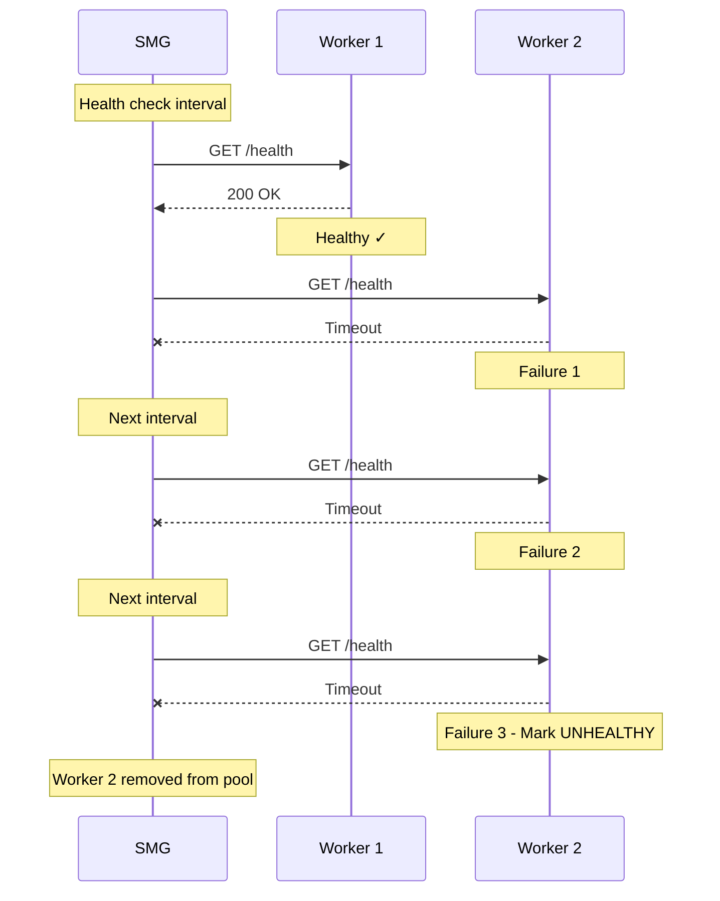

# Health Checks

Background health checks continuously monitor worker availability, removing unhealthy workers from the selection pool before they can cause request failures.

---

## Overview

<div class="grid" markdown>

<div class="card" markdown>

### :material-heart-pulse: Proactive Monitoring

Detect worker failures before they impact requests—not after.

</div>

<div class="card" markdown>

### :material-shield-check: Automatic Isolation

Unhealthy workers are removed from the pool without manual intervention.

</div>

<div class="card" markdown>

### :material-refresh: Self-Healing

Workers automatically rejoin the pool when they recover.

</div>

<div class="card" markdown>

### :material-tune: Configurable Sensitivity

Tune detection speed vs. tolerance for temporary issues.

</div>

</div>

---

## Why Health Checks?

Without proactive health checks:

- **Reactive detection**: Failures only discovered when real requests fail
- **Wasted requests**: Multiple requests may fail before worker is marked unhealthy
- **Slower recovery**: No way to know when a worker has recovered without trying it

With health checks:

- **Proactive detection**: Unhealthy workers removed before they cause failures
- **Fast recovery**: Workers rejoin the pool as soon as they're healthy
- **No wasted requests**: Real requests only go to verified healthy workers

---

## How It Works

SMG sends periodic HTTP requests to each worker's health endpoint:



### Health States

| State | Meaning | Traffic |
|-------|---------|---------|
| **Healthy** | Passing health checks | Receives requests |
| **Unhealthy** | Consecutive failures ≥ threshold | No requests |

### State Transitions

**Healthy → Unhealthy**: When consecutive failed health checks reach `--health-failure-threshold`

**Unhealthy → Healthy**: When consecutive successful health checks reach `--health-success-threshold`

---

## Configuration

```bash
smg \
  --worker-urls http://w1:8000 http://w2:8000 \
  --health-check-interval-secs 60 \
  --health-failure-threshold 3 \
  --health-success-threshold 2 \
  --health-check-timeout-secs 5 \
  --health-check-endpoint /health
```

### Parameters

| Parameter | Default | Description |
|-----------|---------|-------------|
| `--health-check-interval-secs` | `60` | Interval between health checks |
| `--health-failure-threshold` | `3` | Consecutive failures before marking unhealthy |
| `--health-success-threshold` | `2` | Consecutive successes to mark healthy again |
| `--health-check-timeout-secs` | `5` | Timeout for each health check request |
| `--health-check-endpoint` | `/health` | Endpoint path for health checks |
| `--disable-health-check` | `false` | Disable background health checks |

---

## Recommended Configurations

<div class="grid" markdown>

<div class="card" markdown>

### :material-lightning-bolt: Fast Detection

Sensitive to failures—detect issues quickly.

```bash
smg \
  --health-check-interval-secs 10 \
  --health-failure-threshold 2 \
  --health-check-timeout-secs 3
```

**Use when**: Critical availability, rapid failure response needed

</div>

<div class="card" markdown>

### :material-shield: Conservative Detection

Tolerant of network blips.

```bash
smg \
  --health-check-interval-secs 120 \
  --health-failure-threshold 5 \
  --health-success-threshold 3
```

**Use when**: Flaky networks, workers with occasional slow responses

</div>

<div class="card" markdown>

### :material-server-network: Production Balanced

Balanced detection for typical deployments.

```bash
smg \
  --health-check-interval-secs 30 \
  --health-failure-threshold 3 \
  --health-success-threshold 2 \
  --health-check-timeout-secs 5
```

**Use when**: Standard production environments

</div>

<div class="card" markdown>

### :material-close-circle: No Health Checks

Disable health checks entirely.

```bash
smg --disable-health-check
```

**Use when**: External health monitoring, testing scenarios

</div>

</div>

---

## Worker Health Endpoint

SMG expects workers to provide a health endpoint that returns:

- **2xx status code**: Worker is healthy
- **Any other status or timeout**: Worker is unhealthy

### Example Health Endpoint (vLLM)

vLLM workers expose `/health` by default:

```bash
# vLLM automatically provides /health endpoint
vllm serve meta-llama/Llama-3.1-8B-Instruct --port 8000
```

### Example Health Endpoint (SGLang)

SGLang workers expose `/health` by default:

```bash
# SGLang automatically provides /health endpoint
python -m sglang.launch_server --model-path meta-llama/Llama-3.1-8B-Instruct --port 8000
```

### Custom Health Endpoint

If your worker uses a different health endpoint:

```bash
smg \
  --worker-urls http://worker:8000 \
  --health-check-endpoint /api/health
```

---

## Interaction with Circuit Breakers

Health checks and circuit breakers work together for comprehensive fault detection:

| Health Check | Circuit Breaker | Worker State |
|--------------|-----------------|--------------|
| Passing | Closed | Healthy, receiving traffic |
| Failing | Open | Unhealthy, no traffic |
| Passing | Open | Recovering, limited traffic (half-open) |

**Key differences**:

- **Health checks**: Proactive background monitoring (no request impact)
- **Circuit breakers**: Reactive detection based on real request failures

Both are recommended for production deployments.

---

## Monitoring

### Metrics

| Metric | Description |
|--------|-------------|
| `smg_health_check_total` | Health check results by worker and status |
| `smg_worker_health_status` | Current health status per worker (0=unhealthy, 1=healthy) |

### Useful PromQL Queries

<div class="grid" markdown>

<div class="card" markdown>

#### Health Status

```promql
# Current health status per worker
smg_worker_health_status

# Count of unhealthy workers
count(smg_worker_health_status == 0)
```

</div>

<div class="card" markdown>

#### Check Results

```promql
# Health check success rate
rate(smg_health_check_total{status="success"}[5m]) /
rate(smg_health_check_total[5m])

# Failed checks per minute
rate(smg_health_check_total{status="failure"}[1m]) * 60
```

</div>

</div>

### Alert Thresholds

| Metric | Warning | Critical | Action |
|--------|---------|----------|--------|
| Unhealthy workers | 1 worker | >50% workers | Investigate worker health |
| Health check success rate | <90% | <70% | Check network connectivity |
| Check duration | >timeout/2 | >timeout | Workers may be overloaded |

### Alerting Example

```yaml
groups:
  - name: smg-health-checks
    rules:
      - alert: WorkerUnhealthy
        expr: smg_worker_health_status == 0
        for: 5m
        labels:
          severity: warning
        annotations:
          summary: "Worker {{ $labels.worker_id }} is unhealthy"

      - alert: MajorityUnhealthy
        expr: count(smg_worker_health_status == 0) > count(smg_worker_health_status) / 2
        for: 1m
        labels:
          severity: critical
        annotations:
          summary: "Majority of workers are unhealthy"
```

---

## Tuning Guidelines

| Symptom | Potential Adjustment |
|---------|---------------------|
| Workers marked unhealthy too quickly | Increase `--health-failure-threshold` |
| Slow failure detection | Decrease `--health-check-interval-secs` |
| Health checks timing out | Increase `--health-check-timeout-secs` |
| Workers slow to rejoin | Decrease `--health-success-threshold` |
| Too many health check requests | Increase `--health-check-interval-secs` |

---

## What's Next?

<div class="grid" markdown>

<div class="card" markdown>

### :material-electric-switch: Circuit Breakers

Reactive failure detection based on real request failures.

[Circuit Breakers →](circuit-breakers.md)

</div>

<div class="card" markdown>

### :material-refresh: Retries

Automatic retry with exponential backoff for transient failures.

[Retries →](retries.md)

</div>

<div class="card" markdown>

### :material-power: Graceful Shutdown

Allow in-flight requests to complete during shutdown.

[Graceful Shutdown →](graceful-shutdown.md)

</div>

</div>
