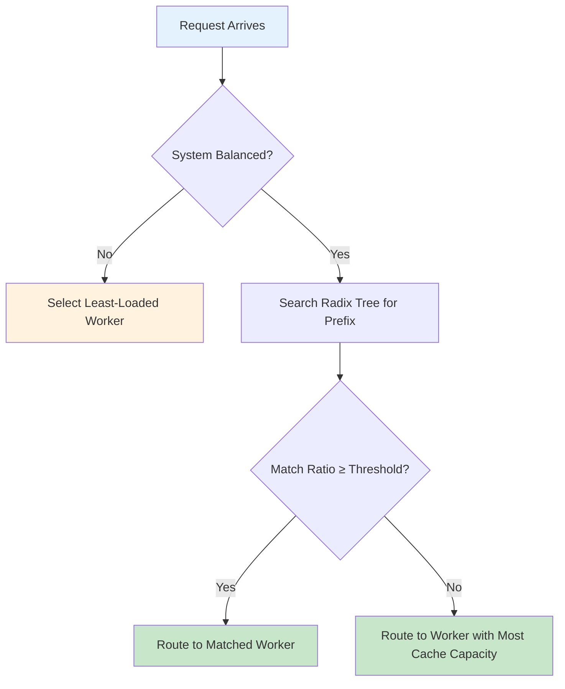

# Cache-Aware Routing

Cache-aware routing is SMG's most sophisticated load balancing policy. It maintains a multi-tenant radix tree that mirrors backend KV cache state, enabling perfect cache prediction and optimal worker selection.

---

## Overview

<div class="grid" markdown>

<div class="card" markdown>

### :material-tree: Radix Tree Mirroring

SMG maintains an exact replica of each backend's KV cache structure, enabling 100% accurate prefix match calculations.

</div>

<div class="card" markdown>

### :material-sync: Backend Synchronization

Uses the same tokens, page sizes, and eviction policies as backend schedulers (SGLang, vLLM, TensorRT-LLM).

</div>

<div class="card" markdown>

### :material-scale-balance: Intelligent Load Balancing

Automatically switches between cache affinity and load-based routing based on real-time worker state.

</div>

<div class="card" markdown>

### :material-lightning-bolt: Dramatic TTFT Reduction

Achieves 70-75% reduction in Time to First Token through optimal KV cache reuse.

</div>

</div>

---

## Why Cache-Aware Routing?

LLM inference workers maintain a **KV cache** of previously computed attention states. When a new request shares a prefix with a previous request, the worker can skip recomputing that portion—dramatically reducing latency.

<div class="grid" markdown>

<div class="card" markdown>

### :material-message-text: Multi-Turn Conversations

Same system prompt across turns. Growing context benefits from cached prefixes.

</div>

<div class="card" markdown>

### :material-file-document-multiple: RAG Applications

Common document snippets. Shared retrieval prefixes across queries.

</div>

<div class="card" markdown>

### :material-tray-full: Batch Processing

Similar prompts in sequence. Template-based generation with variable suffixes.

</div>

<div class="card" markdown>

### :material-account-group: Shared System Prompts

Multiple users with same instructions. Amortized prefill cost across sessions.

</div>

</div>

**The Challenge:** If requests with shared prefixes go to different workers, each worker must recompute the same prefix independently—wasting GPU cycles.

**Cache-Aware Solution:** Route requests to workers that already have the relevant prefix cached, maximizing KV cache hits and minimizing redundant computation.

---

## Multi-Tenant Radix Tree Architecture

<div class="architecture-diagram">
  
</div>

SMG maintains a **multi-tenant radix tree** that mirrors the KV cache state on each backend worker. This enables true cache-aware routing with 100% prefix match accuracy.

<div class="grid" markdown>

<div class="card" markdown>

### :material-sync: 100% Backend Synchronization

The gateway's radix tree uses the **exact same parameters** as backend schedulers:

- **Same tokens**: Pre-tokenized input matches backend representation
- **Same page size**: Aligned to kernel page boundaries (e.g., 16 tokens for FlashInfer)
- **Same eviction policy**: LRU, LFU, FIFO, MRU, FILO, or Priority

</div>

<div class="card" markdown>

### :material-tree: Two Tree Implementations

| Tree Type | Mode | Input | Use Case |
|-----------|------|-------|----------|
| **StringTree** | HTTP | Raw text | OpenAI-compatible endpoints |
| **TokenTree** | gRPC | Token IDs | Direct worker communication |

</div>

</div>

**Why This Matters:**

- **Perfect Cache Prediction**: Since the gateway tree mirrors backend behavior exactly, prefix match calculations are 100% accurate
- **Kernel-Aware**: Honors page boundaries used by inference kernels (FlashInfer, Mamba, etc.)
- **Eviction Parity**: Tracks the same eviction policy as SGLang/vLLM/TensorRT-LLM schedulers

---

## Routing Algorithm

### Two-State Decision Model

Cache-aware routing operates in two states based on system load:

<div class="grid" markdown>

<div class="card" markdown>

### :material-cached: Balanced State (Cache-Affinity Mode)

When workers are evenly loaded:

1. Search radix tree for longest matching prefix
2. If match ratio ≥ `cache-threshold` → route to matched worker
3. If match ratio < threshold → route to worker with most cache capacity

**Goal**: Maximize KV cache hit rate

</div>

<div class="card" markdown>

### :material-scale-balance: Imbalanced State (Load-Balance Mode)

When load difference exceeds thresholds:

1. Calculate load difference: `max_load - min_load`
2. Calculate load ratio: `max_load / min_load`
3. If both exceed thresholds → route to least loaded worker

**Goal**: Prevent worker overload

</div>

</div>

### Imbalance Detection

The system is considered imbalanced when **both** conditions are met:

```
(max_load - min_load) > balance_abs_threshold
        AND
max_load > balance_rel_threshold × min_load
```

| Parameter | Default | Description |
|-----------|---------|-------------|
| `balance_abs_threshold` | 64 | Absolute load difference threshold |
| `balance_rel_threshold` | 1.5 | Relative load ratio threshold (1.5 = 50% difference) |

### Selection Flow



---

## Performance Impact

### Benchmarks

In typical conversational workloads:

| Metric | Without Cache-Aware | With Cache-Aware | Improvement |
|--------|---------------------|------------------|-------------|
| **TTFT (p50)** | 150ms | 45ms | **70%** |
| **TTFT (p99)** | 800ms | 200ms | **75%** |
| **Cache hit rate** | 0% | 65% | - |
| **GPU utilization** | 85% | 70% | **18% reduction** |

!!! note "Results vary based on workload"
    Workloads with diverse, unique prompts will see smaller improvements. Workloads with repeated prefixes (chatbots, RAG) see the largest gains.

### When Cache-Aware Helps Most

<div class="grid" markdown>

<div class="card" markdown>

#### :material-check-circle: High Impact

- Multi-turn conversations with shared system prompts
- RAG applications with common document prefixes
- Batch processing with template-based prompts
- Multiple users with identical instructions

</div>

<div class="card" markdown>

#### :material-close-circle: Lower Impact

- Completely random, unique prompts
- Single-turn diverse queries
- Very short prompts (< 50 tokens)
- Highly variable system prompts

</div>

</div>

---

## Tuning Guidelines

### Cache Threshold

The `cache-threshold` parameter controls how aggressively routing favors cache affinity:

| Value | Behavior | Use Case |
|-------|----------|----------|
| **Low (0.1-0.2)** | More cache hits, potential hot spots | Conversational workloads |
| **Default (0.3)** | Balanced approach | Most deployments |
| **High (0.5-0.8)** | Fewer cache hits, better load balance | Diverse workloads |

!!! tip "Recommendation"
    Start with the default (0.3) and increase if you observe hot spots or uneven load distribution.

### Balance Thresholds

| Scenario | Recommendation |
|----------|---------------|
| **Homogeneous workers** | Higher thresholds (favor caching) |
| **Heterogeneous workers** | Lower thresholds (favor load balance) |
| **Bursty traffic** | Lower thresholds (prevent queuing) |
| **Steady traffic** | Higher thresholds (maximize cache hits) |

### Memory Management

The radix tree grows with unique prefixes. Configure based on your memory budget:

| Memory Budget | `max-tree-size` | Unique Prefixes |
|---------------|-----------------|-----------------|
| 1 GB | 16,777,216 | ~16M nodes |
| 4 GB | 67,108,864 | ~64M nodes (default) |
| 16 GB | 268,435,456 | ~256M nodes |

**Eviction**: SMG periodically evicts stale entries using LRU policy. Configure with `--eviction-interval` (default: 120 seconds).

---

## Monitoring

### Key Metrics

| Metric | Description | Alert Threshold |
|--------|-------------|-----------------|
| `smg_router_cache_hits_total` | Cache hit count | - |
| `smg_router_cache_misses_total` | Cache miss count | - |
| `smg_router_cache_tree_size` | Radix tree node count | >90% of max |
| `smg_worker_requests_active` | Active requests per worker | Imbalance >50% |

### Useful PromQL Queries

<div class="grid" markdown>

<div class="card" markdown>

#### Cache Hit Rate

```promql
rate(smg_router_cache_hits_total[5m]) /
(rate(smg_router_cache_hits_total[5m]) +
 rate(smg_router_cache_misses_total[5m]))
```

</div>

<div class="card" markdown>

#### Load Distribution

```promql
stddev(smg_worker_requests_active) /
avg(smg_worker_requests_active)
```

</div>

</div>

### Alert Thresholds

| Metric | Warning | Critical | Action |
|--------|---------|----------|--------|
| Cache hit rate | <50% | <30% | Review workload patterns |
| Tree size | >80% max | >95% max | Increase `max-tree-size` or reduce eviction interval |
| Load imbalance | >30% | >50% | Lower balance thresholds |

---

## Multi-Gateway Considerations

When running multiple SMG instances behind a load balancer:

- Each instance maintains its **own radix tree**
- Cache efficiency drops by **10-20%** compared to single instance
- Consider **session affinity** at the load balancer to improve cache hits

### Load Balancer Configuration

=== "NGINX"

    ```nginx
    upstream smg {
        hash $http_x_user_id consistent;  # Affinity by user
        server smg-1:30000;
        server smg-2:30000;
    }
    ```

=== "HAProxy"

    ```haproxy
    backend smg
        balance hdr(X-User-ID)
        hash-type consistent
        server smg-1 smg-1:30000 check
        server smg-2 smg-2:30000 check
    ```

=== "Kubernetes"

    ```yaml
    apiVersion: networking.k8s.io/v1
    kind: Ingress
    metadata:
      annotations:
        nginx.ingress.kubernetes.io/upstream-hash-by: "$http_x_user_id"
    ```

---

## Comparison with Other Policies

| Aspect | cache_aware | prefix_hash | consistent_hashing |
|--------|-------------|-------------|-------------------|
| **Memory** | O(tokens) | O(workers) | O(workers) |
| **Lookup** | O(prefix_len) | O(log n) | O(log n) |
| **Precision** | Exact matching | Prefix grouping | Key-based |
| **Cache locality** | Excellent | Good | Key-dependent |
| **Load balancing** | Integrated | Load factor | None |

---

## What's Next?

<div class="grid" markdown>

<div class="card" markdown>

### :material-cog: Configure Routing

Set up cache-aware routing with detailed parameter options.

[Routing Configuration →](../../configuration/routing.md)

</div>

<div class="card" markdown>

### :material-scale-balance: Load Balancing

Compare all available routing policies.

[Load Balancing →](load-balancing.md)

</div>

<div class="card" markdown>

### :material-chart-box: Metrics Reference

Complete list of routing metrics.

[Metrics Reference →](../../reference/metrics.md)

</div>

</div>
