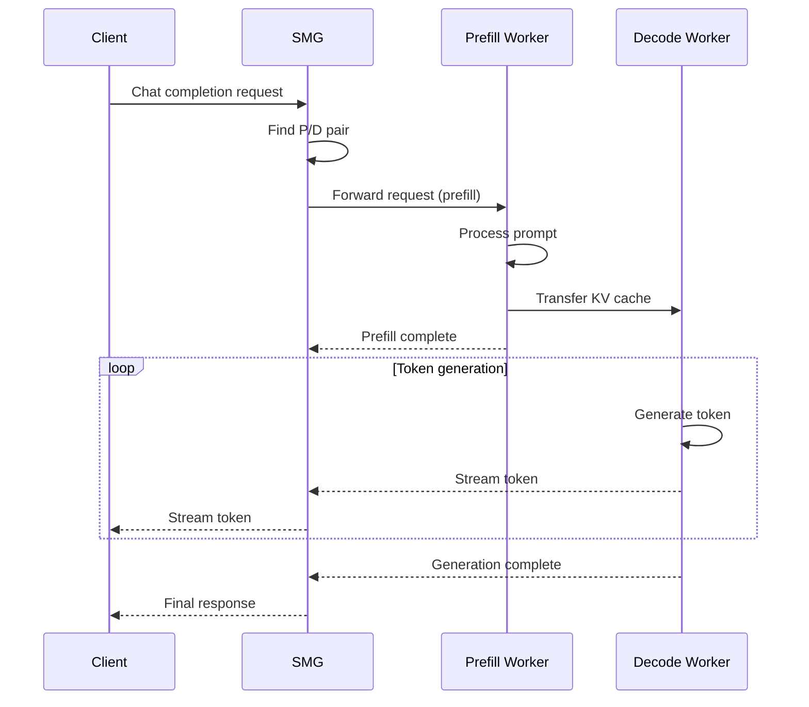

# PD Disaggregation

Prefill-Decode (PD) disaggregation separates the two phases of LLM inference onto specialized workers, optimizing Time to First Token (TTFT) and Time Per Output Token (TPOT) independently.

---

## Overview

<div class="grid" markdown>

<div class="card" markdown>

### :material-lightning-bolt: Optimized TTFT

Dedicated prefill workers process prompts with maximum throughput.

</div>

<div class="card" markdown>

### :material-speedometer: Optimized TPOT

Dedicated decode workers generate tokens with minimal latency.

</div>

<div class="card" markdown>

### :material-arrow-expand-all: Independent Scaling

Scale prefill and decode workers based on their specific resource needs.

</div>

<div class="card" markdown>

### :material-memory: KV Cache Transfer

Automatic coordination of KV cache transfer between worker types.

</div>

</div>

---

## Why Disaggregate?

Traditional LLM inference has two distinct phases with different characteristics:

| Phase | Compute Pattern | Bottleneck | Optimization |
|-------|-----------------|------------|--------------|
| **Prefill** | Compute-bound, parallel | GPU compute | Batch similar-length prompts |
| **Decode** | Memory-bound, sequential | Memory bandwidth | Maximize batch size |

Running both phases on the same worker creates inefficiencies:

- Prefill batches are delayed waiting for decode slots
- Decode batches are small due to prefill memory pressure
- Neither phase is optimally configured

**PD disaggregation solves this** by dedicating workers to each phase.

---

## How It Works



### Request Flow

1. **Request arrives** at SMG gateway
2. **Find P/D pair**: Select a prefill worker and decode worker
3. **Prefill phase**: Prefill worker processes the prompt
4. **KV transfer**: KV cache is transferred to decode worker
5. **Decode phase**: Decode worker generates tokens
6. **Stream response**: Tokens are streamed back to client

---

## Configuration

### Basic Setup

```bash
smg \
  --pd-disaggregation \
  --worker-urls http://prefill1:8000 http://prefill2:8000 \
  --decode http://decode1:8000 http://decode2:8000
```

### Parameters

| Parameter | Description |
|-----------|-------------|
| `--pd-disaggregation` | Enable PD disaggregated mode |
| `--worker-urls` | Prefill worker URLs |
| `--decode` | Decode worker URLs |
| `--prefill-policy` | Routing policy for prefill workers |
| `--decode-policy` | Routing policy for decode workers |

### Per-Phase Policies

Configure different routing policies for each phase:

```bash
smg \
  --pd-disaggregation \
  --worker-urls http://prefill1:8000 http://prefill2:8000 \
  --decode http://decode1:8000 http://decode2:8000 \
  --prefill-policy cache_aware \
  --decode-policy power_of_two
```

### Supported Policies

Both prefill and decode support these policies:

| Policy | Prefill Use Case | Decode Use Case |
|--------|------------------|-----------------|
| `cache_aware` | Maximize prompt cache hits | Less beneficial |
| `power_of_two` | Balance prefill load | Balance decode load |
| `round_robin` | Even distribution | Even distribution |
| `random` | Simple distribution | Simple distribution |

**Recommended**: `cache_aware` for prefill, `power_of_two` for decode.

---

## Kubernetes Service Discovery

Use label selectors to automatically discover prefill and decode workers.

### Configuration

```bash
smg \
  --service-discovery \
  --pd-disaggregation \
  --prefill-selector "app=sglang,role=prefill" \
  --decode-selector "app=sglang,role=decode" \
  --service-discovery-namespace inference
```

### Worker Deployments

```yaml
# Prefill workers
apiVersion: apps/v1
kind: StatefulSet
metadata:
  name: sglang-prefill
  namespace: inference
spec:
  replicas: 2
  selector:
    matchLabels:
      app: sglang
      role: prefill
  template:
    metadata:
      labels:
        app: sglang
        role: prefill
    spec:
      containers:
        - name: sglang
          image: lmsysorg/sglang:latest
          args:
            - --model-path=meta-llama/Llama-3.1-70B-Instruct
            - --port=8000
            - --prefill-only
          resources:
            limits:
              nvidia.com/gpu: 4

---
# Decode workers
apiVersion: apps/v1
kind: StatefulSet
metadata:
  name: sglang-decode
  namespace: inference
spec:
  replicas: 4
  selector:
    matchLabels:
      app: sglang
      role: decode
  template:
    metadata:
      labels:
        app: sglang
        role: decode
    spec:
      containers:
        - name: sglang
          image: lmsysorg/sglang:latest
          args:
            - --model-path=meta-llama/Llama-3.1-70B-Instruct
            - --port=8000
            - --decode-only
          resources:
            limits:
              nvidia.com/gpu: 2
```

---

## P/D Pair Selection

SMG maintains awareness of which prefill and decode workers can communicate.

### Pairing Strategies

| Strategy | Description | Best For |
|----------|-------------|----------|
| **Any-to-Any** | Any prefill can send to any decode | Network with uniform latency |
| **Affinity** | Prefer co-located pairs | Reduce KV transfer latency |
| **Load-Based** | Select least loaded pair | Maximize throughput |

### KV Cache Transfer

The KV cache is transferred between workers using the backend's native mechanism:

| Backend | Transfer Method |
|---------|-----------------|
| SGLang | NCCL/Gloo over network |
| vLLM | Disaggregated prefill protocol |
| TensorRT-LLM | Native KV transfer |

SMG coordinates the transfer by:

1. Adding routing headers to the prefill request
2. Specifying the target decode worker
3. Waiting for transfer confirmation before streaming

---

## Sizing Guidelines

### Prefill Workers

Prefill is **compute-bound**:

- More GPUs per worker = faster prefill
- Fewer workers with more GPUs is often better
- Size for your longest prompts

| Prompt Length | Recommended GPUs |
|---------------|------------------|
| < 4K tokens | 1-2 GPUs |
| 4K - 16K tokens | 2-4 GPUs |
| 16K - 64K tokens | 4-8 GPUs |
| > 64K tokens | 8+ GPUs |

### Decode Workers

Decode is **memory-bandwidth-bound**:

- More workers = higher throughput
- Smaller workers can batch more requests
- Size for your target concurrency

| Concurrent Users | Recommended Setup |
|------------------|-------------------|
| < 50 | 2 decode workers |
| 50 - 200 | 4 decode workers |
| 200 - 500 | 8 decode workers |
| > 500 | 16+ decode workers |

### Ratio Guidelines

| Workload Type | Prefill:Decode Ratio |
|---------------|----------------------|
| Short prompts, long outputs | 1:4 |
| Balanced prompts/outputs | 1:2 |
| Long prompts, short outputs | 1:1 or 2:1 |
| RAG with large context | 2:1 |

---

## Monitoring

### Metrics

| Metric | Description |
|--------|-------------|
| `smg_pd_prefill_duration_seconds` | Prefill phase duration |
| `smg_pd_decode_duration_seconds` | Decode phase duration |
| `smg_pd_kv_transfer_duration_seconds` | KV cache transfer time |
| `smg_pd_pair_selections_total` | P/D pair selection count |

### Key Performance Indicators

| KPI | Target | Indicates |
|-----|--------|-----------|
| TTFT | < 500ms | Prefill performance |
| TPOT | < 50ms | Decode performance |
| KV transfer time | < 100ms | Network performance |

### PromQL Queries

<div class="grid" markdown>

<div class="card" markdown>

#### Phase Duration

```promql
# Average prefill time
rate(smg_pd_prefill_duration_seconds_sum[5m]) /
rate(smg_pd_prefill_duration_seconds_count[5m])

# Average decode time per token
rate(smg_pd_decode_duration_seconds_sum[5m]) /
rate(smg_pd_decode_duration_seconds_count[5m])
```

</div>

<div class="card" markdown>

#### Worker Utilization

```promql
# Prefill worker utilization
smg_worker_requests_active{role="prefill"} /
smg_worker_max_concurrent{role="prefill"}

# Decode worker utilization
smg_worker_requests_active{role="decode"} /
smg_worker_max_concurrent{role="decode"}
```

</div>

</div>

---

## Troubleshooting

| Symptom | Cause | Solution |
|---------|-------|----------|
| High TTFT | Prefill workers overloaded | Add prefill workers or GPUs |
| High TPOT | Decode workers overloaded | Add decode workers |
| KV transfer timeout | Network congestion | Check network bandwidth |
| Uneven load | Poor pairing | Adjust routing policy |
| Decode queue buildup | Prefill too fast | Balance P:D ratio |

### Debug Logging

```bash
RUST_LOG=smg::pd=debug smg --pd-disaggregation ...
```

### Verify Configuration

```bash
# Check discovered workers
curl http://smg:3001/workers | jq

# Check worker roles
curl http://smg:3001/workers | jq '.[] | {url, role}'
```

---

## Complete Example

### Production Configuration

```bash
smg \
  --service-discovery \
  --pd-disaggregation \
  --prefill-selector "app=sglang,role=prefill" \
  --decode-selector "app=sglang,role=decode" \
  --prefill-policy cache_aware \
  --decode-policy power_of_two \
  --cb-failure-threshold 3 \
  --health-check-interval-secs 10 \
  --host 0.0.0.0 \
  --port 8000
```

### Static Worker Configuration

```bash
smg \
  --pd-disaggregation \
  --worker-urls http://prefill-0:8000 http://prefill-1:8000 \
  --decode http://decode-0:8000 http://decode-1:8000 http://decode-2:8000 http://decode-3:8000 \
  --prefill-policy cache_aware \
  --decode-policy power_of_two
```

---

## What's Next?

<div class="grid" markdown>

<div class="card" markdown>

### :material-kubernetes: Service Discovery

Automatic worker discovery in Kubernetes.

[Service Discovery →](../architecture/service-discovery.md)

</div>

<div class="card" markdown>

### :material-cached: Cache-Aware Routing

Optimize prefill with cache-aware routing.

[Cache-Aware Routing →](cache-aware.md)

</div>

<div class="card" markdown>

### :material-scale-balance: Load Balancing

All available routing policies.

[Load Balancing →](load-balancing.md)

</div>

</div>
