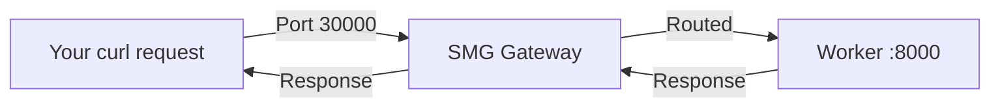

# Quickstart

Deploy Shepherd Model Gateway and route your first request in under 5 minutes.

<div class="objectives" markdown>

#### What you'll learn

- Start SMG with a simple configuration
- Connect to an inference worker
- Send a chat completion request through the gateway

</div>

<div class="prerequisites" markdown>

#### Before you begin

You need:

- SMG [installed](installation.md)
- An LLM inference worker running (we'll show you how to start one if you don't have one)

</div>

---

## Step 1: Start an Inference Worker

If you don't have a worker running, start one using SGLang:

```bash
# Using Docker
docker run -p 8000:8000 --gpus all \
  lightseekorg/smg:latest \
  python -m sglang.launch_server \
  --model-path meta-llama/Llama-3.1-8B-Instruct \
  --port 8000
```

Wait for the worker to initialize. You should see:

```
INFO:     Uvicorn running on http://0.0.0.0:8000
```

!!! tip "No GPU?"
    For testing without a GPU, you can use any OpenAI-compatible mock server or the OpenAI API itself.

---

## Step 2: Start SMG

Now start the gateway pointing to your worker:

=== "Docker"

    ```bash
    docker run -p 30000:30000 --network host \
      lightseekorg/smg:latest \
      --worker-urls http://localhost:8000 \
      --policy cache_aware
    ```

=== "Binary"

    ```bash
    smg \
      --worker-urls http://localhost:8000 \
      --policy cache_aware \
      --host 0.0.0.0 \
      --port 30000
    ```

You should see:

```
INFO smg::server: Starting Shepherd Model Gateway
INFO smg::worker: Registered worker: http://localhost:8000
INFO smg::server: Listening on 0.0.0.0:30000
```

---

## Step 3: Send a Request

Test the gateway with a chat completion request:

```bash
curl http://localhost:30000/v1/chat/completions \
  -H "Content-Type: application/json" \
  -d '{
    "model": "meta-llama/Llama-3.1-8B-Instruct",
    "messages": [
      {"role": "user", "content": "What is the capital of France?"}
    ],
    "max_tokens": 50
  }'
```

You should receive a response like:

```json
{
  "id": "chatcmpl-abc123",
  "object": "chat.completion",
  "model": "meta-llama/Llama-3.1-8B-Instruct",
  "choices": [
    {
      "index": 0,
      "message": {
        "role": "assistant",
        "content": "The capital of France is Paris."
      },
      "finish_reason": "stop"
    }
  ],
  "usage": {
    "prompt_tokens": 14,
    "completion_tokens": 8,
    "total_tokens": 22
  }
}
```

:tada: **Congratulations!** You've successfully deployed SMG and routed your first request.

---

## Step 4: Verify Health

Check that the gateway is healthy:

```bash
# Gateway health
curl http://localhost:30000/health

# Worker status
curl http://localhost:30000/workers
```

---

## What You've Accomplished



You now have:

- [x] A running SMG gateway on port 30000
- [x] One connected inference worker
- [x] Cache-aware load balancing enabled
- [x] OpenAI-compatible API endpoint

---

## Next Steps

<div class="grid" markdown>

<div class="card" markdown>

### Add More Workers

Scale out by adding additional workers.

```bash
smg \
  --worker-urls http://worker1:8000 http://worker2:8000 \
  --policy cache_aware
```

</div>

<div class="card" markdown>

### Enable Monitoring

Add Prometheus metrics to observe your gateway.

[Configure Monitoring →](../tasks/operations/monitoring.md)

</div>

<div class="card" markdown>

### Deploy to Kubernetes

Run SMG with service discovery in K8s.

[K8s Deployment →](../tasks/deployment/kubernetes.md)

</div>

<div class="card" markdown>

### Learn Concepts

Understand how SMG works under the hood.

[Read Concepts →](../concepts/index.md)

</div>

</div>

---

## Troubleshooting

??? question "Gateway starts but can't connect to worker"

    **Symptoms:** Gateway logs show connection errors.

    **Solutions:**

    1. Verify the worker is running: `curl http://localhost:8000/health`
    2. Check network connectivity between gateway and worker
    3. If using Docker, ensure proper network configuration (`--network host` or Docker network)

??? question "Request times out"

    **Symptoms:** Requests hang or return 504 errors.

    **Solutions:**

    1. Check worker health: `curl http://localhost:30000/workers`
    2. Increase timeout: `--request-timeout-secs 120`
    3. Check worker logs for errors

??? question "Model not found error"

    **Symptoms:** `model not found` in response.

    **Solutions:**

    1. The `model` field in requests should match the model loaded on the worker
    2. Check available models: `curl http://localhost:30000/v1/models`
