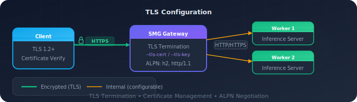

# Configure TLS

This guide shows how to secure SMG communications with TLS and mTLS planning.

<div class="prerequisites" markdown>

#### Before you begin

- Completed the [Getting Started](index.md) guide
- TLS certificates (or follow the steps below to generate them)

</div>

---

## Overview

SMG supports TLS configurations for securing communications:

| Configuration | Purpose | Status |
|---------------|---------|--------|
| **Server TLS** | HTTPS for client → gateway communication | Available |
| **Client mTLS** | Mutual TLS for gateway → worker communication | Planned |

<div class="architecture-diagram">
  
</div>

!!! info "Client mTLS"
    Client mTLS for gateway-to-worker communication is planned but not yet implemented via CLI. See the [Client mTLS section](#client-mtls-planned) below for details.

---

## Generate Certificates

For testing, generate self-signed certificates:

### Step 1: Create CA

```bash
# Generate CA private key
openssl genrsa -out ca.key 4096

# Generate CA certificate
openssl req -new -x509 -days 365 -key ca.key -out ca.crt \
  -subj "/CN=SMG CA/O=SMG"
```

### Step 2: Create server certificate

```bash
# Generate server private key
openssl genrsa -out server.key 2048

# Generate server CSR
openssl req -new -key server.key -out server.csr \
  -subj "/CN=smg.example.com/O=SMG"

# Sign with CA
openssl x509 -req -days 365 -in server.csr \
  -CA ca.crt -CAkey ca.key -CAcreateserial \
  -out server.crt
```

### Step 3: Create client certificate (for future mTLS)

!!! note "For future use"
    Client certificates are not currently used by SMG CLI. This step is documented for when client mTLS support is added.

```bash
# Generate client private key
openssl genrsa -out client.key 2048

# Generate client CSR
openssl req -new -key client.key -out client.csr \
  -subj "/CN=smg-client/O=SMG"

# Sign with CA
openssl x509 -req -days 365 -in client.csr \
  -CA ca.crt -CAkey ca.key -CAcreateserial \
  -out client.crt
```

---

## Enable Server TLS

Serve the gateway over HTTPS.

### Configuration

```bash
smg \
  --worker-urls http://worker:8000 \
  --tls-cert-path /path/to/server.crt \
  --tls-key-path /path/to/server.key \
  --host 0.0.0.0 \
  --port 443
```

### Verification

```bash
curl --cacert ca.crt https://smg.example.com/health
```

---

## Client mTLS (Planned)

!!! note "Not yet implemented via CLI"
    Client mTLS for gateway-to-worker communication is not yet available via CLI arguments. The `--client-cert-path`, `--client-key-path`, and `--ca-cert-path` flags are planned but not currently implemented.

    For now, gateway-to-worker communication uses plain HTTP/HTTPS without mutual TLS. If your workers require mTLS, consider using a service mesh (like Istio) or a sidecar proxy to handle the mTLS termination.

When implemented, client mTLS will secure communication between the gateway and workers:

```bash
# Planned - not yet available
smg \
  --worker-urls https://worker1:8443 https://worker2:8443 \
  --client-cert-path /path/to/client.crt \
  --client-key-path /path/to/client.key \
  --ca-cert-path /path/to/ca.crt
```

---

## Full TLS Configuration

Currently, only server TLS is supported via CLI:

```bash
smg \
  --worker-urls http://worker1:8000 http://worker2:8000 \
  --tls-cert-path /etc/certs/server.crt \
  --tls-key-path /etc/certs/server.key \
  --api-key "${API_KEY}" \
  --host 0.0.0.0 \
  --port 443
```

---

## Kubernetes with cert-manager

Use cert-manager for automatic certificate management.

### Step 1: Install cert-manager

```bash
kubectl apply -f https://github.com/cert-manager/cert-manager/releases/download/v1.14.0/cert-manager.yaml
```

### Step 2: Create Certificate

```yaml title="smg-certificate.yaml"
apiVersion: cert-manager.io/v1
kind: Certificate
metadata:
  name: smg-tls
  namespace: inference
spec:
  secretName: smg-tls-secret
  issuerRef:
    name: letsencrypt-prod
    kind: ClusterIssuer
  dnsNames:
    - smg.example.com
```

### Step 3: Mount in deployment

```yaml
spec:
  containers:
    - name: smg
      volumeMounts:
        - name: tls-certs
          mountPath: /etc/certs
          readOnly: true
      args:
        - --tls-cert-path
        - /etc/certs/tls.crt
        - --tls-key-path
        - /etc/certs/tls.key
  volumes:
    - name: tls-certs
      secret:
        secretName: smg-tls-secret
```

---

## Verification

### Test server TLS

```bash
# With CA certificate
curl --cacert ca.crt https://smg.example.com/health

# Check certificate details
openssl s_client -connect smg.example.com:443 -showcerts
```

### Test worker connectivity

```bash
# Check SMG logs for worker connections
kubectl logs -n inference -l app=smg | grep -i worker

# Verify worker connection via control plane API
curl https://localhost:30000/workers
```

---

## Troubleshooting

??? question "Certificate verification failed"

    1. Verify CA certificate matches:
    ```bash
    openssl verify -CAfile ca.crt server.crt
    ```

    2. Check certificate expiration:
    ```bash
    openssl x509 -in server.crt -noout -dates
    ```

    3. Verify hostname matches:
    ```bash
    openssl x509 -in server.crt -noout -text | grep DNS
    ```

??? question "Connection refused"

    1. Check SMG is listening on correct port:
    ```bash
    netstat -tlnp | grep smg
    ```

    2. Verify TLS configuration in logs:
    ```bash
    smg --tls-cert-path ... 2>&1 | grep -i tls
    ```

??? question "Handshake failure"

    1. Check TLS version compatibility
    2. Verify cipher suite support
    3. Ensure certificate chain is complete

---

## What's Next?

- [Monitoring](monitoring.md) — Set up observability and alerts
- [Authentication Concepts](../concepts/security/authentication.md) — Security architecture and controls
