# Shepherd Model Gateway

**High-performance inference gateway for LLM deployments**

One gateway for routing, load balancing, and orchestrating traffic across your LLM fleet.

[Get Started](getting-started/index.md){ .button .button--primary }
[GitHub](https://github.com/lightseekorg/smg){ .button .button--secondary }

70%
TTFT Reduction

<1ms
Routing Latency

40+
Prometheus Metrics

100%
OpenAI Compatible

Works with

vLLM
SGLang
TensorRT-LLM
OpenAI
Claude
Gemini

---

## What SMG does

SMG sits between your applications and LLM workers. It manages routing, failover, tokenization, and observability so you can scale inference without building that infrastructure yourself.

### :material-server-network: Full OpenAI server mode

In gRPC mode, SMG handles tokenization, chat templates, tool calling, MCP, reasoning loops, and detokenization at the gateway. Workers just run inference.

### :material-speedometer: Sub-millisecond routing

Written in Rust. Gateway-side tokenizer caching, token-level streaming, cache-aware routing. Designed for throughput.

### :material-shield-check: Production reliability

Circuit breakers, retries with exponential backoff, rate limiting, health monitoring. Keeps your inference stack up.

### :material-chart-line: Built-in observability

40+ Prometheus metrics, OpenTelemetry tracing, structured logging. See what's happening without extra tooling.

---

## Three operating modes

  

### :material-lightning-bolt: gRPC mode

SMG handles everything — tokenization, chat templates, tool parsing, MCP loops, detokenization, PD routing. Workers run raw inference.

### :material-swap-horizontal: HTTP mode

SMG handles routing, load balancing, and failover. Workers run full OpenAI-compatible servers. Supports prefill-decode disaggregation.

### :material-cloud-outline: External mode

Route to OpenAI, Claude, Gemini through a single endpoint. Mix self-hosted and cloud models behind one API.

---

### Getting started

Install, connect workers, send your first request.

[Quickstart →](getting-started/index.md)

### Architecture & concepts

Routing strategies, reliability features, extensibility.

[Concepts →](concepts/index.md)

### API reference

OpenAI-compatible API, admin endpoints, gateway extensions.

[Reference →](reference/index.md)

### Contributing

Development setup, code style, how to contribute.

[Contribute →](contributing/index.md)

:fontawesome-brands-github: [GitHub](https://github.com/lightseekorg/smg) · :fontawesome-brands-slack: [Slack](https://join.slack.com/t/lightseekorg/shared_invite/zt-3py6mpreo-XUGd064dSsWeQizh3YKQrQ) · :fontawesome-brands-discord: [Discord](https://discord.gg/wkQ73CVTvR)

