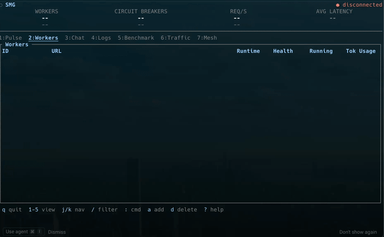

# smg-tui

Terminal dashboard for [Shepherd Model Gateway](../README.md) — monitor workers, route traffic, and chat with models, all from your terminal.


## Install

```bash
cargo build -p smg-tui --release
# Binary at: target/release/smg-tui
```

## Quick Start

```bash
# Auto-start gateway and connect
 ./target/release/smg-tui --auto-start

# Connect to an existing gateway
 ./target/release/smg-tui --gateway-url http://localhost:30000

# With API key for OpenAI/Anthropic models
OPENAI_API_KEY=sk-...  ./target/release/smg-tui --auto-start
```

## CLI Options

| Flag               | Default                  | Env Var                                               | Description                    |
|--------------------|--------------------------|-------------------------------------------------------|--------------------------------|
| `--gateway-url`    | `http://localhost:30000` |                                                       | SMG gateway base URL           |
| `--metrics-url`    | `http://localhost:29000` |                                                       | Prometheus metrics endpoint    |
| `--poll-interval`  | `3`                      |                                                       | Polling interval (seconds)     |
| `--api-key`        |                          | `SMG_API_KEY`, `OPENAI_API_KEY`, `ANTHROPIC_API_KEY`  | API key for authenticated endpoints |
| `--auto-start`     | `false`                  |                                                       | Start gateway if not reachable |

### Auto-Start

When `--auto-start` is passed and the gateway is not reachable:

1. Launches `smg launch` with `--enable-igw --policy round_robin`
2. Falls back to `cargo run -p smg` if the binary isn't in PATH
3. Polls the health endpoint until the gateway is ready (up to 120s)
4. On `q`: TUI exits but gateway keeps running. On `Ctrl+C ×2`: full shutdown kills the gateway

## Views

Switch views with number keys `1`-`7`.

| Key | View       | Description                                           |
|-----|------------|-------------------------------------------------------|
| `1` | Pulse      | Real-time dashboard with worker health, throughput sparkline, request stats |
| `2` | Workers    | Worker table with running reqs, token usage, detail panel |
| `3` | Chat       | Interactive streaming chat with any model             |
| `4` | Logs       | TUI logs, gateway logs, per-worker logs with sub-tabs |
| `5` | Benchmark  | *(coming soon)*                                       |
| `6` | Traffic    | *(coming soon)*                                       |
| `7` | Mesh       | *(coming soon)*                                       |

---

## Stats Bar

The top header displays four metric cards updated every poll cycle:

```text
    WORKERS          CIRCUIT BREAKERS          REQ/S            AVG LATENCY
       5                    5                  250.3              450ms
   all healthy          all closed          51 in-flight        ▓▓▓░░░░░
```

| Card             | Source                                    | Description                              |
|------------------|-------------------------------------------|------------------------------------------|
| WORKERS          | `GET /workers`                            | Total count + health status              |
| CIRCUIT BREAKERS | `smg_worker_cb_state` (Prometheus)        | Open/closed count + failure tracking     |
| REQ/S            | `smg_router_requests_total` (Prometheus)  | Requests per second + in-flight count    |
| AVG LATENCY      | `smg_router_request_duration` (Prometheus)| Per-interval avg latency with gauge bar  |

---

## Pulse View

Two-column real-time dashboard:

**Left column:**
- **Worker Health** — workers grouped by model (local) or provider (external), each with health dot, hostname, runtime, connection mode
- **GPUs** — GPU utilization, memory bar, temperature via `nvidia-smi` (auto-hides when unavailable)

**Right column:**
- **Throughput** — req/s sparkline over 60s window with tok/s when available
- **Request Stats** — avg latency (with sparkline), active connections, in-flight requests

---

## Workers View

| Key        | Action                                |
|------------|---------------------------------------|
| `j`/`Down` | Move selection down                  |
| `k`/`Up`   | Move selection up                    |
| `Enter`    | Toggle detail panel                   |
| `a`        | Add worker wizard                     |
| `d`        | Delete worker (kills backend process) |
| `e`        | Edit worker (action menu)             |
| `/`        | Filter workers                        |

### Table Columns

| Column    | HTTP sglang/vllm       | gRPC sglang           | External (OpenAI)     |
|-----------|------------------------|-----------------------|-----------------------|
| Running   | `num_running_reqs`     | `req/s` (Prometheus)  | `req/s` (Prometheus)  |
| Tok Usage | KV cache `token_usage` | N/A                   | N/A                   |

### Detail Panel

Press `Enter` to toggle. Shows:

**Config:** URL, runtime, mode, health, models served

**Stats (HTTP sglang/vllm):**
- Running requests with gauge bar (current / max)
- Waiting requests
- KV cache usage with gauge bar (tokens used / total)
- Gen throughput (when available)

**Stats (gRPC / External):**
- Req/s from Prometheus
- Circuit breaker state (open/closed)

---

## Chat View

Interactive chat with any model through the SMG gateway.

| Key          | Action                             |
|--------------|------------------------------------|
| `Enter`      | Send message                       |
| `Tab`        | Cycle through available models     |
| `Shift+Tab`  | Cycle endpoint (chat / responses)  |
| `Esc`        | Cancel streaming / clear input     |
| `Up`/`Down`  | Scroll conversation                |

**Features:**
- Streaming responses with live cursor
- Markdown rendering — **bold**, *italic*, `code`, headings, bullets, fenced code blocks
- Multi-turn conversation:
  - **Chat completions** (`/v1/chat/completions`): sends full conversation history each turn
  - **Responses API** (`/v1/responses`): uses `previous_response_id` for efficient multi-turn
- Title bar shows current model, endpoint, and multi-turn mode
- Auto-selects first available model on send
- Model filtering: local models shown as-is, OpenAI filtered to `gpt-5.4*` to keep the list manageable

---

## Logs View

Sub-tab system for viewing different log sources:

| Key | Action                          |
|-----|---------------------------------|
| `a` | Switch to TUI application logs  |
| `b` | Switch to SMG gateway logs      |
| `w` | Cycle through worker logs       |
| `j`/`k` | Scroll up/down             |
| `G` | Jump to bottom (auto-scroll)    |

```text
 a:TUI  b:SMG  w:Llama-37595  w:Qwen2-39223          j/k scroll  G bottom  w worker
```

- **TUI logs**: Application events (worker add/delete, status changes)
- **SMG logs**: Gateway logs from `/tmp/smg-gateway.log` (ANSI stripped)
- **Worker logs**: Per-worker logs from `/tmp/smg-worker-{port}.log`, labeled as `model(5chars)-port`

---

## Adding Workers



### External Providers (API-based)

Press `a` → `1. External` → select provider → enter API key (or press Enter to use env var):

| Provider  | URL                                        | Env Var           |
|-----------|--------------------------------------------|-------------------|
| OpenAI    | `https://api.openai.com`                   | `OPENAI_API_KEY`  |
| Anthropic | `https://api.anthropic.com`                | `ANTHROPIC_API_KEY` |
| xAI       | `https://api.x.ai`                         | `XAI_API_KEY`     |
| Gemini    | `https://generativelanguage.googleapis.com` | `GEMINI_API_KEY`  |

The API key is stored on the worker for model discovery (required in IGW mode).

### Local Workers (sglang / vllm)

Press `a` → `2. Local` → select runtime → connection mode → model preset:

| Preset         | Model ID                                        | TP |
|----------------|------------------------------------------------|----|
| Llama-3.2-1B   | `meta-llama/Llama-3.2-1B-Instruct`             | 1  |
| Llama-3.1-8B   | `meta-llama/Llama-3.1-8B-Instruct`             | 1  |
| Qwen2.5-7B     | `Qwen/Qwen2.5-7B-Instruct`                     | 1  |
| Qwen2.5-14B    | `Qwen/Qwen2.5-14B-Instruct`                    | 2  |
| DeepSeek-R1-7B | `deepseek-ai/DeepSeek-R1-Distill-Qwen-7B`      | 1  |
| Mistral-7B     | `mistralai/Mistral-7B-Instruct-v0.3`           | 1  |

**GPU management:**
- Auto-selects free GPUs (>2GB free via `nvidia-smi`)
- Sets `CUDA_VISIBLE_DEVICES` to avoid conflicts
- Tracks claimed GPUs to prevent double-allocation before memory shows in `nvidia-smi`
- Releases GPU claims on worker deletion
- Kills backend process on worker deletion

### Custom URL

Press `a` → `3. Custom URL` → enter worker URL directly.

### Command Mode

Press `:` for command mode:

```text
:add <url> [--provider <p>] [--runtime <r>]
:delete <id>
:priority <number>
:cost <number>
:flush-cache
:toggle-health
:quit
```

---

## Key Bindings

| Key             | Context    | Action                           |
|-----------------|------------|----------------------------------|
| `1`-`7`         | Global     | Switch view                      |
| `q`             | Global     | Quit TUI (services keep running) |
| `Ctrl+C` ×2    | Global     | Full shutdown (stop all services) |
| `?`             | Global     | Toggle help overlay              |
| `/`             | Workers    | Filter mode                      |
| `:`             | Workers    | Command mode                     |
| `Esc`           | Any        | Close overlay / clear filter     |
| `j` / `Down`    | Workers    | Move selection down              |
| `k` / `Up`      | Workers    | Move selection up                |
| `Enter`         | Workers    | Toggle detail panel              |
| `a`             | Workers    | Add worker wizard                |
| `d`             | Workers    | Delete worker                    |
| `e`             | Workers    | Action menu                      |
| `Enter`         | Chat       | Send message                     |
| `Tab`           | Chat       | Cycle model                      |
| `Shift+Tab`     | Chat       | Cycle endpoint                   |
| `a`/`b`/`w`     | Logs       | Switch log sub-tab               |
| `G`             | Logs       | Jump to bottom                   |

---

## Architecture

The TUI polls the SMG gateway every `--poll-interval` seconds via:

| Endpoint              | Data                                  |
|-----------------------|---------------------------------------|
| `GET /readiness`      | Gateway health                        |
| `GET /workers`        | Worker list, models, health           |
| `GET /get_loads`      | Per-worker load details (HTTP only)   |
| `GET /v1/models`      | Available models                      |
| `GET /ha/status`      | Cluster status (mesh mode)            |
| `GET /ha/health`      | Mesh health                           |
| `GET /metrics` (Prometheus) | req/s, latency, circuit breakers, tokens, per-worker counts |

Chat uses `POST /v1/chat/completions` and `POST /v1/responses` with SSE streaming.
